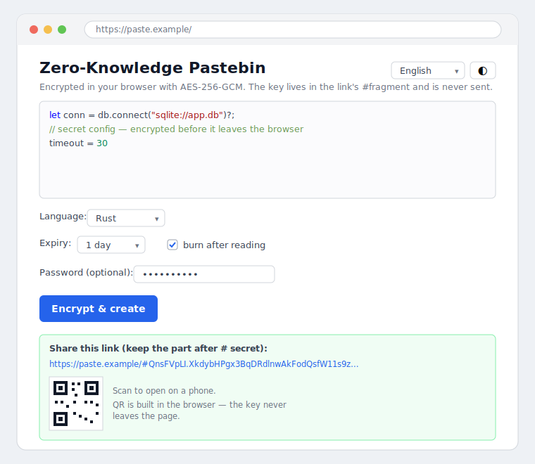

# Pastebin Service

A clean, layered, **zero-knowledge** pastebin REST API (Axum + SQLite/sqlx) with
a tiny browser client that encrypts and decrypts in-page. Stores text snippets
("pastes") and serves them back by id, with TTL expiry, burn-after-read, content
size limits, optional per-IP rate limiting, and an optional Redis read-cache.

> **A self-contained service.** It has no dependency on anything outside this
> folder — its own crate, lockfile, migrations, static assets, Dockerfile, and
> tests — with **no Cargo workspace** linking it to anything else. It builds,
> runs, and ships entirely on its own.
>
> Architecture: [`./docs/ARCHITECTURE.md`](./docs/ARCHITECTURE.md).



> The image above is a mockup of the actual page (`static/index.html`); drop a
> real screenshot in `docs/img/` and update the link to replace it.

## Zero-knowledge web client

The server serves a tiny browser client (`GET /` and `GET /app.js`, embedded in
the binary via `include_str!`) that does all cryptography **in the browser** with
**256-bit AES-GCM** (authenticated encryption, via the WebCrypto API). The server
side is unchanged by this — it stores the ciphertext as opaque content and never
learns it is encrypted. That is the whole trick: *zero knowledge is a client
property, achieved by never sending the key to the server.*


How it works:

1. **Create** — the browser generates a random 256-bit key, encrypts the text
   with a fresh random IV, and POSTs `base64(iv).base64(ciphertext)` to
   `POST /api/pastes` as ordinary content. The key is base64url-encoded into the
   link **fragment**: `https://host/#<id>.<key>`.
2. **The `#fragment` is never sent to the server** by browsers, so the server
   cannot see the key — only the ciphertext it stored.
3. **View** — opening the link loads the page; the client reads `id` and `key`
   from the fragment, fetches the ciphertext (`GET /raw/<id>`), and decrypts it
   locally. Burn-after-read (`one_shot`) and TTL apply as usual.

### Threat model (please read before trusting it with secrets)

- ✅ **Server breach / subpoena** reveals only ciphertext — the operator has
  plausible deniability over paste contents.
- ✅ **Burn-after-read & TTL** bound how long a secret can exist.
- ⚠️ **You must trust the server to serve honest JavaScript.** A malicious or
  compromised server could ship code that exfiltrates the key. Always use
  **HTTPS** (ideally with HSTS); don't open links from an instance you suspect is
  compromised.
- ✅ **Optional password protection** — when set, the AES key is derived
  (PBKDF2-SHA256) from *both* the URL-fragment key **and** the password, so the
  link alone is not enough; the password is never stored or sent. Without a
  password, anyone with the full link can read the paste, so share links
  privately.
- ⚠️ **Access logs** can reveal *who* fetched a paste (not *what*).

This is the same model as [PrivateBin](https://github.com/PrivateBin/PrivateBin).
Beyond the core security model (client-side AES-256-GCM, key in the URL fragment,
optional password, TTL, burn-after-read), the web client also offers:

- **Syntax highlighting** — choose a language on create; the hint is encrypted
  *inside* the payload (`{text, syntax}`), so the server never even learns the
  language. Highlighting is a small, dependency-free, XSS-safe pass applied on
  view.
- **QR code** of the share link — generated **in the browser** via a vendored
  [`qrcode-generator`](https://github.com/kazuhikoarase/qrcode-generator) (MIT,
  in `static/vendor/`), so the link (with its key fragment) never reaches a third
  party.
- **Internationalization** — UI in English / Spanish / French / German with
  automatic browser-language detection and a manual selector.
- **Dark mode** — follows the system preference, with a toggle.

Out of scope for this minimalist tool: file upload, comments/discussions, and
extra themes/translations.

## Planned endpoints

| Method | Path | Purpose |
|---|---|---|
| `POST` | `/api/pastes` | Create a paste (`{"content","syntax?","ttl_seconds?","one_shot?"}`) |
| `GET` | `/api/pastes/:id` | Fetch metadata + content (JSON) |
| `GET` | `/raw/:id` | Raw content as `text/plain` |
| `DELETE` | `/api/pastes/:id` | Delete a paste |
| `GET` | `/health` · `/health/ready` | Liveness · readiness |

## Run

```bash
cp .env.example .env        # optional; defaults work out of the box
cargo run                   # serves on 127.0.0.1:8090
```

```bash
# Create a paste (optionally: "syntax", "ttl_seconds", "one_shot": true)
curl -s -X POST http://127.0.0.1:8090/api/pastes \
  -H 'Content-Type: application/json' \
  -d '{"content":"hello world","syntax":"text"}'
# -> 201 {"id":"Ab3xY7q2","url":"http://127.0.0.1:8090/api/pastes/Ab3xY7q2",...}

curl http://127.0.0.1:8090/api/pastes/Ab3xY7q2   # JSON metadata + content
curl http://127.0.0.1:8090/raw/Ab3xY7q2          # raw text/plain
curl -X DELETE http://127.0.0.1:8090/api/pastes/Ab3xY7q2   # 204
```

A `one_shot` paste is deleted on its first fetch (burn-after-read); a paste with
`ttl_seconds` becomes `404` once expired.

## Hardening

Every request passes through a middleware stack (outer → inner): `tower_http`
TraceLayer (per-request logs — `RUST_LOG=info,tower_http=debug`), CatchPanicLayer
(panic → `500`), TimeoutLayer (`REQUEST_TIMEOUT_SECS` → `408`),
ConcurrencyLimitLayer (`MAX_CONCURRENT_REQUESTS`), and the body-size limit.
`/health` is dependency-free liveness; `/health/ready` checks the DB (`503` when
unreachable). Shutdown is graceful so the pool drains.

**Per-IP rate limiting** (opt-in): set `RATE_LIMIT_RPS` > 0 (with optional
`RATE_LIMIT_BURST`) to cap requests per client IP via an in-process token
bucket; over-limit requests get `429`. Per-instance limit (each replica counts
independently).

**Redis read-cache** (optional): set `REDIS_URL` to cache fetched pastes, so hot
reads skip the database. Best-effort with DB fallback when Redis is
unset/unreachable. **One-shot pastes are never cached** (so burn-after-read
stays correct); cached entries carry a bounded TTL (≤ the paste's expiry) and are
invalidated on delete.

## Quality gates

```bash
cargo test
cargo clippy -- -D warnings
cargo fmt --check
```

`#![forbid(unsafe_code)]`; config injected (no globals); request bodies size
limited; graceful shutdown. A standalone Cargo project — build, test, and run
entirely from this folder.
